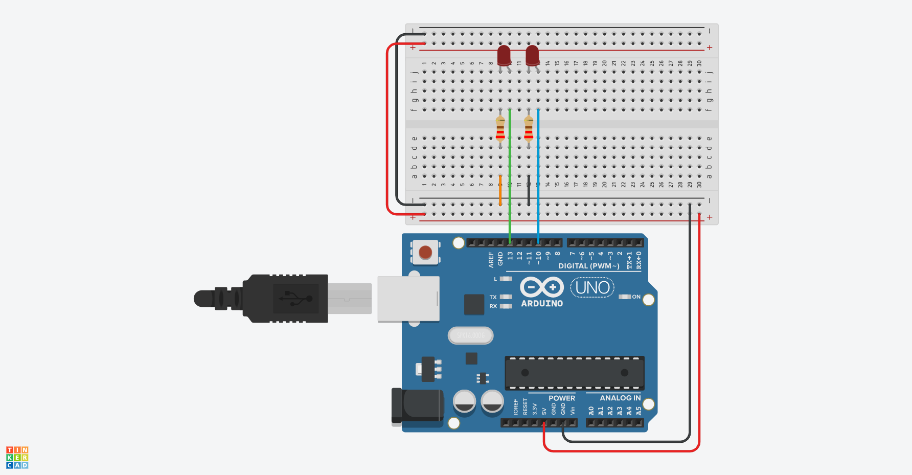
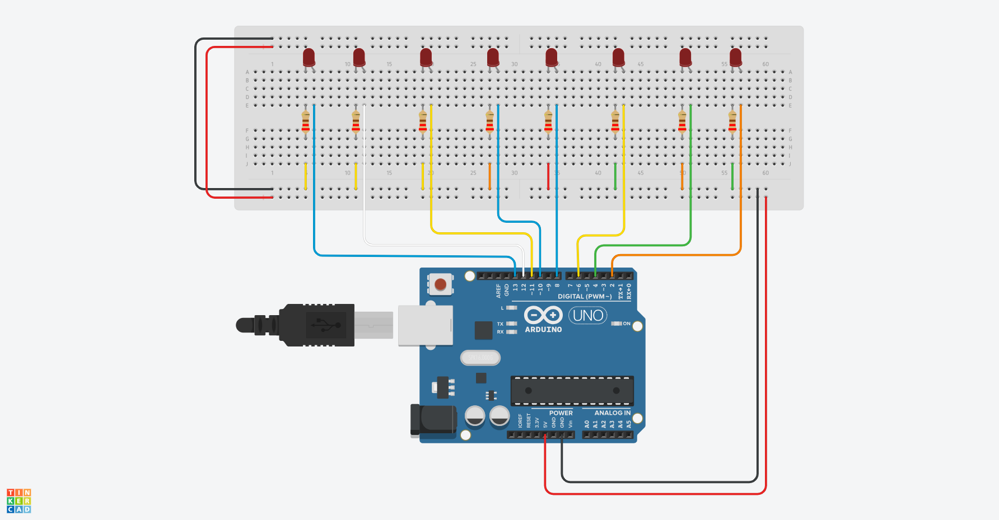
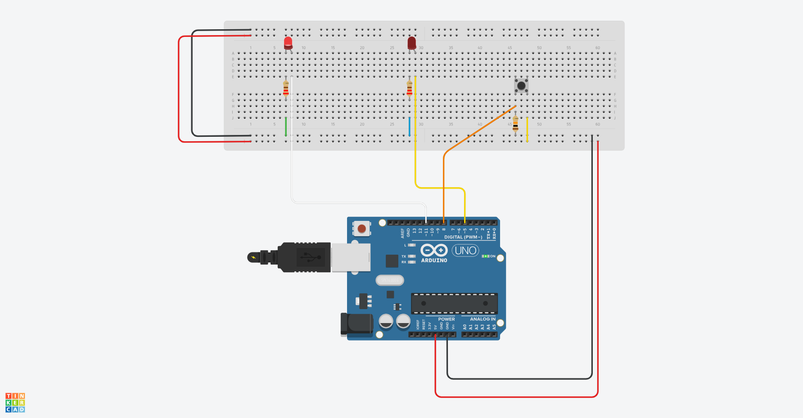

# Hardware Interfacing
## Opdracht 1
- Sluit 2 LED’s aan op poort 10 en 13.
- Laat de LED’s om en om knipperen ( 2s / 2s ) 
- Eerst  Sketch maken.
- Dan Tinkeren en testen •Dan opbouwen en testen.

### Analyse
- Breadboard
- 2x lampjes
- 2x weerstand 220 &#937;
- 8x Connectie draadjes

### Screenshot

### Video
[Watch the game in action](https://your-link-to-video.com)

## Opdracht 2
- Sluit 8 LED’s aan op externe poorten.
- Laat de LED’s heen en weer lopen volgens deze link: http://bit.ly/ArduinoOpdracht3
- Eerst een Sketch maken, dan Tinkeren en daarna testen.
- Als laatste opbouwen en testenOpdracht 2Opdracht 1Bron: pixabay.com

### Analyse
- Breadboard
- 8x lampjes
- 8x weerstand 220 &#937; 
- 20x Connectie draadjes

### Screenshot

### Video
[Watch the game in action](https://your-link-to-video.com)

## Opdracht 3
- Sluit een LED aan op poort 5 en een op poort 11. 
- Sluit een knop aan op poort 8. 
- Laat de 1e LED aangaan door de druk op een drukknop. 
- Laat de 1e LED uitgaan door de druk op dezelfde drukknop. 
- De 2e LED zal altijd tegenovergesteld reageren.

### Analyse
- Breadboard
- 2x lampjes
- 1x knop
- 2x weerstand 220 &#937; & 1x weerstand 10 K&#937;
- 10x Connectie draadjes

### Screenshot

### Video
[Watch the game in action](https://your-link-to-video.com)
