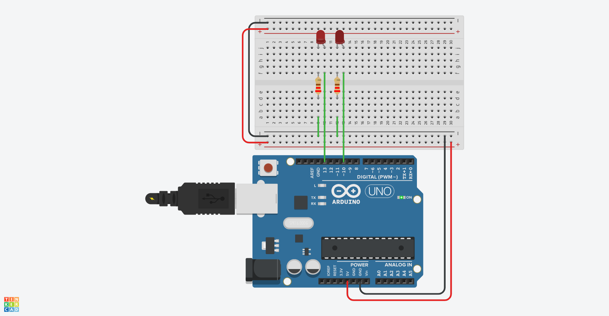

# Hardware Interfacing
## Opdracht 1
- Sluit 2 LED’s aan op poort 10 en 13.
- Laat de LED’s om en om knipperen ( 2s / 2s ) 
- Eerst  Sketch maken.
- Dan Tinkeren en testen •Dan opbouwen en testen.

### Analyse
- Breadboard
- 2 x lampjes
- 2 x weerstand

### Screenshot

### Video

## Opdracht 2
- Sluit 8 LED’s aan op externe poorten.
- Laat de LED’s heen en weer lopen volgens deze link: http://bit.ly/ArduinoOpdracht3
- Eerst een Sketch maken, dan Tinkeren en daarna testen.
- Als laatste opbouwen en testenOpdracht 2Opdracht 1Bron: pixabay.com

### Analyse
- Breadboard
- 8 x lampjes
- 8 x weerstand

### Screenshot

### Video

