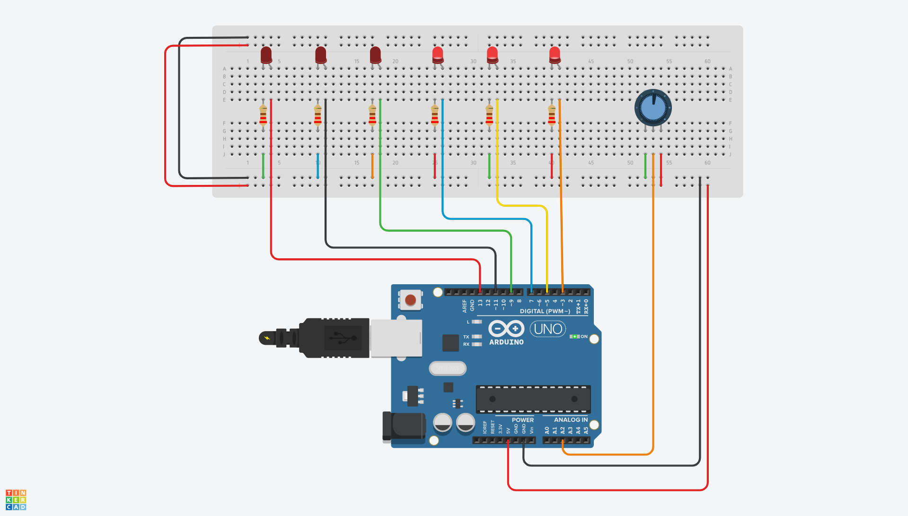
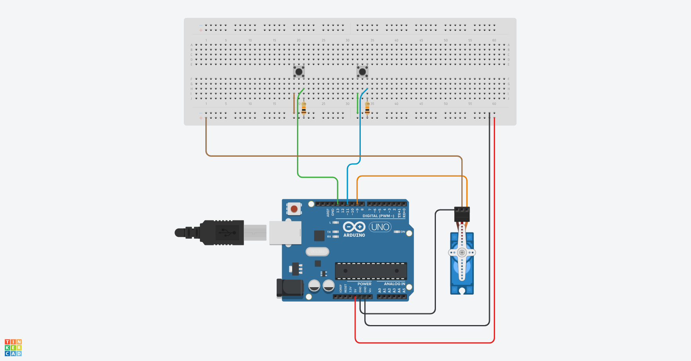

# Hardware Interfacing
## Opdracht 1
- Sluit 2 LED’s aan op poort 10 en 13.
- Laat de LED’s om en om knipperen ( 2s / 2s ) 
- Eerst  Sketch maken.
- Dan Tinkeren en testen •Dan opbouwen en testen.

### Analyse
- Breadboard
- 2x lampjes
- 2x weerstand 220 &#937;
- 8x Connectie draadjes

### Screenshot

### Video
[Watch the lights in action](https://drive.google.com/file/d/1_OCjr27sfI1AORYTMdb1KNq0bK0ZVrU2/view?usp=sharing)

## Opdracht 2
- Sluit 8 LED’s aan op externe poorten.
- Laat de LED’s heen en weer lopen volgens deze link: http://bit.ly/ArduinoOpdracht3
- Eerst een Sketch maken, dan Tinkeren en daarna testen.
- Als laatste opbouwen en testenOpdracht 2Opdracht 1Bron: pixabay.com

### Analyse
- Breadboard
- 8x lampjes
- 8x weerstand 220 &#937; 
- 20x Connectie draadjes

### Screenshot

### Video
[Watch the lights in action](https://your-link-to-video.com)

## Opdracht 3
- Sluit een LED aan op poort 5 en een op poort 11. 
- Sluit een knop aan op poort 8. 
- Laat de 1e LED aangaan door de druk op een drukknop. 
- Laat de 1e LED uitgaan door de druk op dezelfde drukknop. 
- De 2e LED zal altijd tegenovergesteld reageren.

### Analyse
- Breadboard
- 2x lampjes
- 1x knop
- 2x weerstand 220 &#937; & 1x weerstand 10 K&#937;
- 10x Connectie draadjes

### Screenshot

### Video
[Watch the lights in action](https://your-link-to-video.com)

## Opdracht 4
Maak een sketch om 6 LED’s aan te sturen afhankelijk van de 
hoekverdraaiing van de potmeter. (Eerst Tinkeren!!)

Je mag zelf de uitgangen kiezen waar de LED’s op worden aangesloten, 
je mag ook de analoge ingang zelf kiezen. 

- Vergeet niet de voorschakelweerstanden te gebruiken. 
- Hoe verder je de knop naar rechts ( 1023 ) draait, 
  hoe meer LED’s er uit gaan.

### Analyse
- Breadboard
- 6x lampjes
- 6x weerstand 220 &#937
- 19x Connectie draadjes

### Screenshot

### Video
[Watch the lights in action](https://your-link-to-video.com)

## Opdracht 5
Op de Arduino zijn 2 drukknoppen aangesloten. 
- Zolang op drukknop 1 wordt gedrukt draait een servomotor van 0° naar 120° in 3s. 
- Als de servomotor zijn uiterste stand heeft bereikt dan moet hij terugdraaien, ook in 3s. 
- Zolang op drukknop 2 wordt gedrukt draait een servomotor van 0° naar 120° in 0,5s.  
- Als de servomotor zijn uiterste stand heeft bereikt dan moet hij terugdraaien, ook in 0,5s. 
- Worden beide drukknoppen tegelijk ingedrukt, dan zal  de servomotor in 3s van 0° naar 120° draaien, 
5s zo blijven staan en vervolgens in 0.5s terugdraaien naar 0°. 
- De beweging van de servomotor dient in één functie / methode te zijn ontworpen. 
- Ingangen en uitgangen zijn vrij te kiezen.Opdracht 5Bron: pixabay.com

### Analyse
- Breadboard
- 2x buttons
- 2x weerstand 10 K&#937
- 10x Connectie draadjes
- 1x servo motor

### Screenshot

### Video
[Watch the motor in action](https://your-link-to-video.com)
